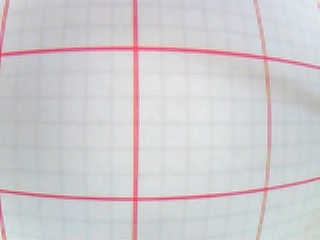
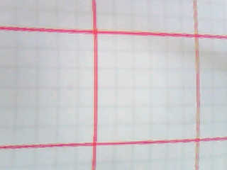
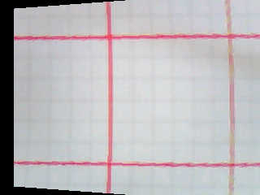
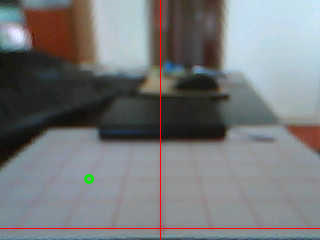
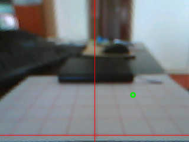
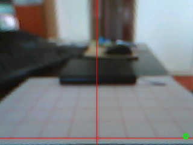

# How to obtain homography matrix between two planes?

## Decide on your application's resolution

OpenMV applications almost always start with:

```python
sensor.reset()
sensor.set_pixformat(sensor.RGB565)
sensor.set_framesize(sensor.QVGA)
sensor.skip_frames(time=2000)
```

The function `sensor.set_framesize()` dictates the resolution. Due to OpenMV's
limited memory and processing power, you often have to lower the resolution to
make the application run.

**All tuning scripts on this page should share your application's resolution.
So, decide on your resolution right now. And use it on all tuning scripts from
here on.**


## Prepare a grid or checkerboard pattern

I mean a *physical* piece of [grid paper](https://incompetech.com/graphpaper/)
or [checkerboard pattern](https://markhedleyjones.com/projects/calibration-checkerboard-collection).
Either will do, as long as the boxes are squares. Print it out.

For simplicity, I refer to it as "the grid" from here on.


## Tune the lens

1. Position the OpenMV camera 10cm above the grid, in a way that grid lines
should appear to the camera straight and square.

2. Load the program [lens_corr.py](lens_corr.py) onto OpenMV camera.

3. Adjust the parameter of
[`lens_corr()`](http://docs.openmv.io/library/omv.image.html#image.image.lens_corr)
until the grid lines appear straight. You may also have to tweak the parameters of
[`rotation_corr()`](http://docs.openmv.io/library/omv.image.html#image.img.rotation_corr)
to get the image square. For some cameras, `rotation_corr()` may not be needed.

This is one of my cameras:

| No correction           | After `lens_corr(1.75)` | After `rotation_corr(y_rotation=-12)` |
| ----------------------- | ----------------------- | ------------------------------------- |
|  |  |            |


## Image vs Floor coordinate system

Our aim is, given a point on the image, to infer a position on the floor.
However, points are represented differently on the two planes.

On the image, `(0, 0)` is at top-left. `X` increases going right, `Y` increases
going down. Points are written as `(X, Y)`.

The floor coordinate system is up to you to invent. Since this is my tutorial,
you get to follow mine. I think of a position on the floor as:

1. how far ahead it is in front of the robot.

2. how far it is to the left or right of the robot. I treat right as positive,
left as negative, zero along the middle.

We go `(forward, sideway)`. For example:
- `(1, 2)` means 1 unit forward, 2 units right
- `(2, -3)` means 2 units forward, 3 units left
- `(3, 0)` means 3 units forward, along the middle

This is the floor coordinate system.


## Fix the camera

1. Mount the OpenMV camera onto the robot. The camera's height and orientation
relative to the floor must be fixed throughout.

2. Load the program [align_grid.py](align_grid.py) to OpenMV camera. Put the
grid in view.

3. Align the grid with the crosshair drawn on the image.


## Pick point correspondences

Pick some points and note down their image coordinates and floor coordinates.

- A minimum of 4 points will do. More are better. I encourage you to get more
  points.

- Avoid picking points forming a straight line, i.e. avoid co-linear points.

- For now, don't worry about the grid's actual size (in mm or inches). We will
  only count the number of *units* in forward and sideway direction. Conversion
  to real-world distance will be done later.

For example:

| Image coordinates `(X,Y)` | Resolution 320 x 240  | Floor coordinates `(forward,sideway)` |
| ------------------------: | --------------------- | :------------------------------------ |
|           119, 201        |  |      1, -1                            |
|           204, 198        |  |      1,  1                            |
|            89, 179        |  |      2, -2                            |
|           224, 159        |  |      3,  2                            |
|           309, 226        |  |      0,  3                            |
|            30, 164        |  |      3, -4                            |


## Save point correspondences to a file

Each pair of point correspondence is put on a line, separated by spaces, and
saved to a file. [For example:](point_correspondence_2.example)

```
119 201  1 -1
204 198  1  1
89  179  2 -2
224 159  3  2
309 226  0  3
30  164  3 -4
```

## Now, we need a Linux machine ...

... because we are going to run a Python 3 script requiring numpy. The script
[fit_homography.py](fit_homography.py) accepts the aforementioned file and gives
you the best fitted *homography matirx*.

```
$ pip3 install numpy click
$ python3 fit_homograph.py point_correspondence_2.example -unit 30

[[ 1.41954610e-01  3.59458059e+00 -8.54247091e+02]
 [-2.67562042e+00  1.12136612e-02  4.30745532e+02]
 [ 9.42999697e-05 -2.39384435e-02  1.00000000e+00]]
--- Verify ---
[119.0, 201.0] -> [1.0072942358322172, -1.0051615896705535]
[204.0, 198.0] -> [1.0174180654913831, 1.011140672615812]
[89.0, 179.0] -> [2.0161538422144525, -1.9799307357370617]
[224.0, 159.0] -> [3.003026911758617, 1.99647062885154]
[309.0, 226.0] -> [-0.015157258570666519, 2.99392394402327]
[30.0, 164.0] -> [2.9703556650383183, -4.01763977097571]
```

The homography matrix is applied back to original data to verify its accuracy. I
hope it gives you confidence that the matrix is correct.

The parameter `-unit` is the real-world size of the grid's square. For example,
my grid square is 30 mm on each side. I pass it `-unit 30`. **Conversion to
real-world unit is included in the homography matrix.**

You may also pass it a flag `-normalize`, which in theory ensures more robust
results. The way we obtain point correspondences, normalization makes very
little difference. I usually do without it.


## Usage in OpenMV

```python
from rv.planar import Planar

H = [[ 1.41954610e-01,  3.59458059e+00, -8.54247091e+02],
     [-2.67562042e+00,  1.12136612e-02,  4.30745532e+02],
     [ 9.42999697e-05, -2.39384435e-02,  1.00000000e+00]]

image_points = [[119, 201],
                [204, 198],
                [89,  179],
                [224, 159],
                [309, 226],
                [30,  164]]

p = Planar(H)

print(p.project(image_points))
```

Note that results are in real-world units.

When we express a position on the floor, it may be more convenient to express it
relative to the robot's toe, or to some body part with physical significance (so
measurement and verification can be done easily). However, due to the way we
position the floor coordinate system, the floor position `(0, 0)` (i.e. the
floor origin) is usually some distance ahead of the robot in some no-man's land.
It would be useful to offset the floor origin to some place we like.

If originally the floor origin is 200 mm in front of the robot's toe, we can
pass in an `offset` as:

```python
p = Planar(H, offset=[200, 0])
```

to add such a distance to all results. In effect, we have offset the floor
origin to the robot's toe, which hopefully makes measurement more convenient and
intuitive.
